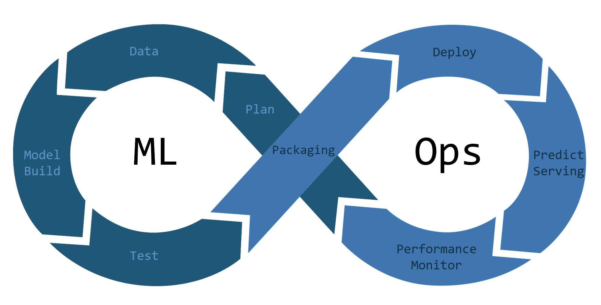

**MLOps and DevOps share many similarities but there are disctinctive differences between the two methodologies, including the scope of problems they intend to solve. Alexandra Abbas, Machine Learning Engineer at Wise gave introductory insight on Machine Learning and the ways Data Science impacts a wide range of processes familiar with DevOps.**

---

**What is it that most people misunderstand about MLOps?**

MLOps refers to a set of practices that aims to deploy and maintain machine learning models in production.

What part of the Data Science Lifecycle (DSLC) is MLOps supposed to cover? I think this question is still not clear for me even though I’ve been working in MLOps for years now. DSLC is a complex iterative process with many stages that have different Ops needs.

_Source: [Coffee Whale](https://coffeewhale.com/what-is-mlops)_

**What are the stages of the Data Science Lifecycle?**

DSLC starts with understanding the business problem that one is trying to solve. Specifically understanding what data is available and in what quantities. Once the data has been discovered, it can be ingested into a system where it can be combined and analyzed. Analysis of the data allows data scientists to uncover correlations and trends in the data that can inform the choice of the machine learning (ML) model in the next stage. Source datasets are transformed into so-called features which form the input to ML models. Data scientists iterate over many feature sets until they find the best set of features that result in the highest accuracy of a model. Parallel to feature engineering, data scientists also iteratively experiment with different ML model architectures until they find the one that works best for the problem and data they have. Once they find the best model they can train the model on the entire dataset.

A trained model is ready to be deployed for serving prediction requests. A deployed model has its own lifecycle. It has to be monitored and versioned; and once new data is available it has to be retrained and re-deployed.

**What is the difference between DevOps and MLOps?**

[DevOps](https://blog.dyrectorio.com/2022-03-01-devops-as-a-service/) covers practices that aim to provide continuous delivery along with high software quality while MLOps does the same on a high level, but it focuses on the lifecycle of ML models rather than traditional software systems. Think of MLOps practices as a subset of DevOps practices that specialize in the continuous delivery of ML models.

**How does this iterative approach extend into the next cycle?**

After a model is released for serving, another problem emerges. Usually the data that the model was trained on is not static, new users sign up, they upload new images to our website and so on. Data is changing, therefore the models have to be re-trained otherwise their performance would degrade. This creates the cyclic nature of MLOps and DSLC.

**How do you measure efficiency over time?**

We use different tools to measure the performance of different parts of the DSLC. Data scientists use accuracy metrics to measure the performance of ML models during experimentation and training. Model artifacts along with their metadata including training accuracy are versioned and monitored using MLflow. Performance of deployed models is monitored real-time using a separate monitoring service that is able to detect shifts in the data distribution.

**How does CI/CD work in MLOps?**

Machine learning models are usually very large files, several gigabytes. These files are usually not stored and versioned in Git. Instead, they are stored in object storage. Training scripts write model artifacts to object storage as a last step.

In order to serve models that are able to accept requests, one needs to build a serving service that can read the model object from storage and load it for serving. This service has its own CI/CD pipeline that is similar to a traditional pipeline. It usually runs the tests, builds the service and deploys the changes.

This serving service can be versioned in Git. Once the service source code is changed or a new model file is added to the service then the CI/CD would trigger a new Docker image build. Once this image is built, it can be [deployed](https://blog.dyrectorio.com/2022-01-01-software-deployment/) in Kubernetes or similar infrastructure platforms.

**How do you treat documentation in MLOps?**

Documentation is not much different from traditional software engineering. After all, it’s really hard to build good applications without good documentation.

There’s a difference though in the DSLC. Data scientists produce large amounts of documentation about experiments they run. They usually use Jupyter Notebooks to document their experiments and share their insights with others. Managing and version control notebooks is a challenge.

**Do you see any cultural differences between MLOps and DevOps?**

Definitely. MLOps has to accommodate the experimental nature of data science. Data science is different from traditional software engineering, it’s more iterative and needs access to large amounts of data in order to function properly. Solutions are messier and less straightforward. These differences in working style result in a cultural difference as well.

---

_This blogpost was written by the team of specialists at [dyrector.io](https://dyrector.io). dyrector.io is an open-source container management platform._

**Find our project on [GitHub](https://github.com/dyrector-io/dyrectorio/). Read our [docs](https://docs.dyrector.io/) to learn more about our platform. Any contribution is welcome!**

To stay updated about our product follow us on [Twitter](https://twitter.com/dyrectorio), [Instagram](https://www.instagram.com/dyrectorio/) and [LinkedIn](https://www.linkedin.com/company/dyrectorio/).

Join our public [Discord](https://discord.gg/hMyT9cbYFD) server to discuss DevOps.
