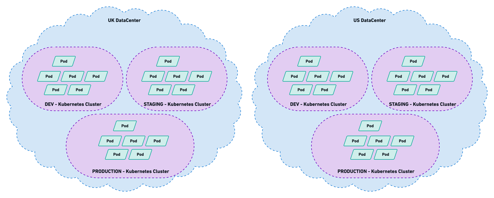
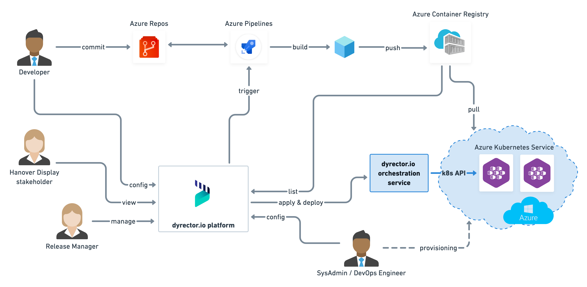

## tl;dr

Hanover Displays designs and manufactures passenger information systems for the public transport industry. They needed to migrate their multi-tenant applications to the cloud, so we set up the required environments for testing, staging and production. We also set up cloud services, including Kubernetes to support the maintainability and security of Hanover's applications.

To manage their app releases on the cloud easier, Hanover uses our product, dyrector.io. It's a developer platform which enables non-technical staff members to manage software releases by assembling products made of containerized applications, tailored to client needs.

## About Hanover

Hanover designs and manufactures passenger information systems for the public transport industry. Satisfied customers in over 75 countries worldwide use a range of Hanover products, attracted by high levels of quality, reliability and customer service. The security afforded by 35 years’ experience, financial independence and a continuous product development programme is further assurance of the company’s dependability. Together with its headquarters and production facility in Lewes, Hanover has a further manufacturing site in Illinois in the US. Both sites produce more than 45,000 units annually across the product range, and shipping to customers in over 75 countries throughout the world for a client list that includes transport authorities, fleet operators, and vehicle manufacturers.

## About Hanover’s Applications

Hanover’s applications run on the cloud and are distributed via Helios. Helios is an application framework that helps enterprises to manage all their business applications in one place promptly. Organizations using Hanover products can tailor their subscriptions to their needs – for example, the number of vehicles they want to use the product on – via Helios, assign roles to the apps within their organization and track productivity, as well as their vehicles’ availability. Helios was developed by Sunilium. 

Hanover’s apps are the following: 

- **Fleet** – Transmodel based asset management
- **Transfers** – Wireless data updater
- **Health** – Device status monitoring
- **Destinations** – Sign editor solution

## Hanover’s Requirements  

Originally Helios ran on an on-prem environment. Our partner needed to move the app to a cloud environment to be able to improve its functionality and stability. Their request was to migrate the application to three Kubernetes clusters – test, staging and production – through Microsoft Azure with geo-redundancy to the Southern region of UK.

## Solution

### Infrastructure

The above-mentioned clusters serve different purposes. In Hanover’s case each of them contains one environment.

Testing environment serves basic level testing of the application. This is used to detect anomalies early during development. This enables developers to gain feedback on the quality of their code earlier to avoid lengthier bugfixes.

Staging is a higher-level environment to test the software, as close to real world use as possible by running simultaneous tests. It resembles a production level environment because the software won’t be used separate from other apps. Therefore, staging environment is necessary to find dependency issues and other problems that slipped through the testing environment.

Production is the highest level of Hanover’s environments. After the application passed all the tests, the live versions of the applications will be stored on this level. This level provides access to users to interact with the application.

### Services

Beginning from the outside, the first in the line is Traffic Manager, allowing us to configure advanced load balancing rules early-on – at the DNS (Domain Name System) layer.

Next in line, public load-balancers within AKS. Each cluster has a Highly-Available Ingress Controller running and forwarding traffic to the backing services while also providing security measurements. The officially suggested Standard Load Balancer supports multiple node-pools and availability zones.

Our sight being already at the internals of the cluster: the application is split into several individually operating parts, divided by namespaces. The minimum number of containers to run exceeds 50, everything concerned it may be well over 100.

Most of the persistent data is stored in MySQL databases, being present either as a managed service for a production environment or simply as a single container for testing environment. As for heavy loads of IOPS, Azure Disks Premium SSD proved to be the solution.

The set requirements contained legacy protocol (ftp) that had to be further separated from the other parts of the application, hosted in an Azure VM. Communications between components are internal not involving the public internet. This is achieved with Azure Virtual Networks and thorough network policies.

### Security

We used different security tools and services to keep Hanover’s operations safe and support high customer satisfaction.

To store at-rest data securely, Azure Database for MySQL uses FIPS 140-2 validated module by default. All data is encrypted on disk, including both backups and temporary files.

Role-based access control provides security to the storage account by restricting access based on the need to know and least privilege security principles. These are given by assigning the desired role to groups and applications at a certain scope.

As the core of network security, network access control limits connectivity to and from specific devices or subnets. The purpose of network layer control is to make sure that containers and services are accessible to only desired users and devices.

We use a cloud-native firewall that provides threat protection for Hanover's workloads. This fully stateful firewall has built-in high availability and unrestricted cloud scalability. It also provides both east-west and north-south traffic inspection.

To provide a representation of Hanover’s network on the cloud, we used Azure Virtual Network. By using this we can fully control the IP address blocks, DNS settings, security policies, and route tables within this network.

It allows us to control the distribution of user traffic for service endpoints in different data centres. By default, service endpoints supported by Traffic Manager include Azure VMs, Web Apps, and Cloud services but we can also use it with external, non-Azure endpoints. It uses the Domain Name System (DNS) to direct client requests to the most appropriate endpoint based on a traffic-routing method and the health of the endpoints.

Load Balancer provides high availability and network performance to Hanover’s applications. It’s a Layer 4 (TCP, UDP) tool that distributes incoming traffic between healthy instances of services defined in a load-balanced set.

## dyrector.io as a platform

dyrector.io DevOps platform enables non-technical staff members – like project managers, billing managers – to manage and monitor software deployments without the assistance of developers.

Organizations face many challenges regarding deployments. On one hand, the process can be a complex and time-consuming. On the other hand, organizations with software products often occupy developers to handle this completely automatable process. This practice burns a lot of money that organizations could allocate to the actual development of their products.
At the same time companies have a hard time to hire DevOps personnel due to its broad technical and cultural approach.

As a DevOps-as-a-Service provider, our purpose is to support organizations’ efforts with an easy-to-use and straightforward product that’s integrated to various services and tools. This provides continuous feedback to our clients on the functionality of their product, resulting less downtime and higher customer satisfaction.

### Actors in dyrector.io's workflow

In dyrector.io’s workflow, we defined 4 roles – developers, release managers, DevOps engineers and stakeholders.

**Developers** commit to Azure Repository, which generates an artifact. In Hanover’s case, the artifact is a Docker image that’s automatically built – this process can be triggered through dyrector.io platform using Azure DevOps, as well, if necessary. After these steps the image is pushed to Hanover’s private registry.

**Release managers** have access to the releases, and they can deploy them to desired environments with a single click through Azure Kubernetes Service. They’re also able to validate functionality and monitor the progress of development. This is a substantial aspect of dyrector.io because it’s the release managers who are in touch with Hanover’s clients. Based on their consultation they can determine the environment each version can be deployed to, and which client can get access to them. This makes dyrector.io an ultimate tool of collaboration in Hanover’s workflows.

**DevOps engineers** – in Hanover’s case, our own staff – configure the components required for these workflows and pipelines, including Azure Kubernetes Service. It’s their responsibility to create communication between dyrector.io platform and Azure DevOps and connect dyrector.io’s orchestration service to the Kubernetes API.

The 4th role in the workflow, **stakeholder** has access to version information but don’t have executional access to functions of the pipeline.

## Results

Our solution delivered results on different levels.

- **Developers** are no longer required to manage deployments; they can work on the products itself while the release manager monitors and executes deployment processes.

- **Release managers** – get more information about releases promptly due to higher transparency of developers’ workflows. Releases and deployments move completely from developer responsibilities to the release manager’s list of tasks. This shift makes release managers able to manage and handle releases entirely.

- **DevOps engineers** – are alerted with sufficient information to better understand failures in the network, resulting in faster reaction time to reduce downtime and maintain a high user experience.

## Reach out to us

If you're interested in our DevOps-as-a-Service solutions, reach out to us at [hello@dyrector.io](hello@dyrector.io) or check our [DevOps-as-a-Service](https://devops.dyrector.io/) site to find out more about our services.

---

_This blogpost was written by the team of specialists at [dyrector.io](https://dyrector.io). As [DevOps-as-a-Service](https://devops.dyrector.io/) providers, we do DevOps stuff every day and we're happy to share our knowledge._

_In the mean time we're working on dyrector.io, a release management platform supporting your DevOps efforts by reducing the time and effort required to deploy your product. Check our plans to simplify your deployments to be able to focus on the things that matter to your team._

To stay updated about our product follow us on [Twitter](https://twitter.com/dyrectorio), [Facebook](https://www.facebook.com/dyrectorio), [Instagram](https://www.instagram.com/dyrectorio/) and [LinkedIn](https://www.linkedin.com/company/dyrectorio/).

Join our public [Discord](https://discord.gg/hMyT9cbYFD) server to discuss DevOps.