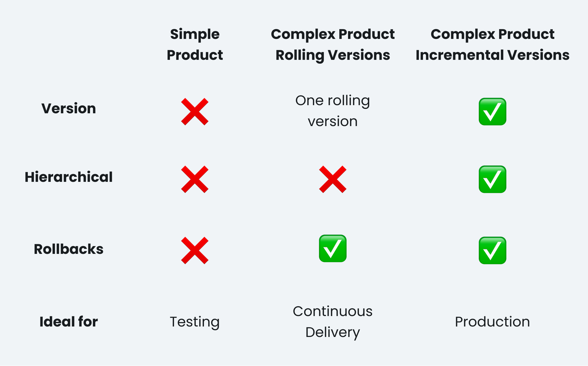

**Products and Versions are very similar components in dyrector.io but they serve different purposes. Read on how to handle the different types of Products for efficient application management.**

---

As their names indicate, Products exist for business purposes, while Versions are rather technical concepts within dyrector.io. Products are the applications you distribute to your clients and users through the platform, therefore it’s a concept on the business side of software development. On the technical side, Versions are unique variants of your Product, but chances are you’re already familiar with software versioning.

## Simple & Complex Product Types

There are two types of Products you can create: Simple and Complex.

### Simple Products

Simple products don’t have any versions, they don’t have any relation to other Products or Versions. This means there’s no way to roll them back. They’re ideal for testing.

You can deploy them to a test environment through dyrector.io right away without any specialist present. In the case of self-hosted dyrector.io, the test node will be the environment you use to run the platform.

### Complex Products

The key difference between Simple and Complex Products is that the ladder comes with a version every time.

There are two types of Complex Products: Rolling and Incremental Versions.

- **Rolling Version:** It consists of one rolling version your teammates can use for continuous delivery, but it can be rolled back and defaulted. When you set a Rolling Version as default, the Rolling Versions you create in the future for this Product will inherit the images and the configurations, so you won’t have to repeatedly add them.

- **Incremental Version:** The most significant difference between Incremental Versions and any other type of Product is that they’re hierarchical to other Versions within the same Product. Incremental Versions are ideal for production, when your application’s functionality has been validated through various tests. Rollbacks and defaulting apply to Incremental Versions, as well.

Complex Products can have both Rolling and Incremental Versions, so you can maintain versions of the same business product for different technical purposes.

## Why should you treat Versions and Products differently?

Each type has a different purpose: what’s ideal for another usage, for example Simple Products for testing, might not be good for the other.

The most common use case of Products on dyrector.io is to create a Simple Product for testing, and either a Rolling Version for CD when users need access to just the latest functioning version or an Incremental Version when your clients need completely different versions of the app you developed for regulatory, business or technical reasons.

By our experience, a less common, but significantly valuable use case of having different versions of your product is when your team develops an extremely complex business application consisting of dozens of images with altering tags that need to be distributed to different clients. Not only Product assembly but configuration management can be all over the place in this case. For this reason, our team is working on bundled configuration management, which will allow users to templatize their variables and secrets, so they won’t have to be specified and assigned repeatedly.

To find out how to create Products and Versions, head to our [documentation](https://docs.dyrector.io).

---

_This blogpost was written by the team of specialists at [dyrector.io](https://dyrector.io). dyrector.io is an open source delivery platform that enables simplified app management without specialists._

**Find our project on [GitHub](https://github.com/dyrector-io/dyrectorio/). Read our [docs](https://docs.dyrector.io/) to learn more about our platform. Any contribution is welcome!**

To stay updated about our product follow us on [Twitter](https://twitter.com/dyrectorio), [Instagram](https://www.instagram.com/dyrectorio/) and [LinkedIn](https://www.linkedin.com/company/dyrectorio/).

Join our public [Discord](https://discord.gg/hMyT9cbYFD) server to discuss DevOps.