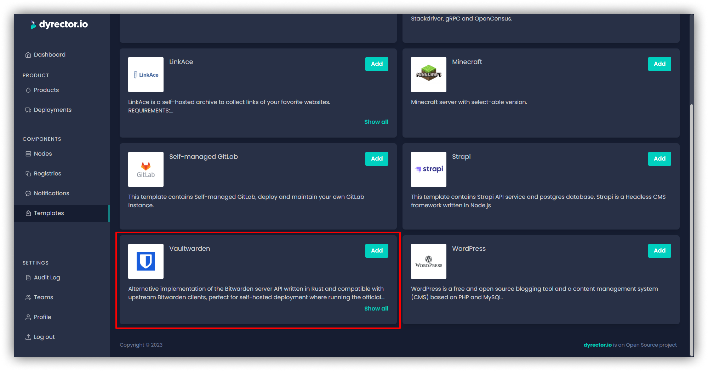
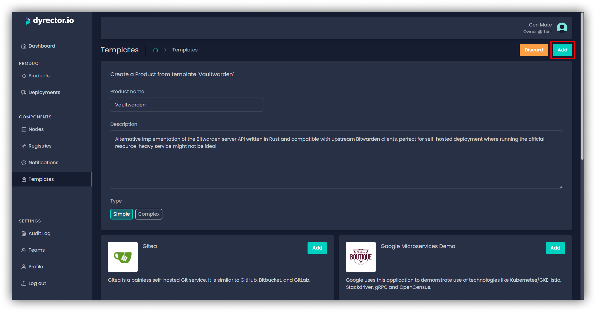
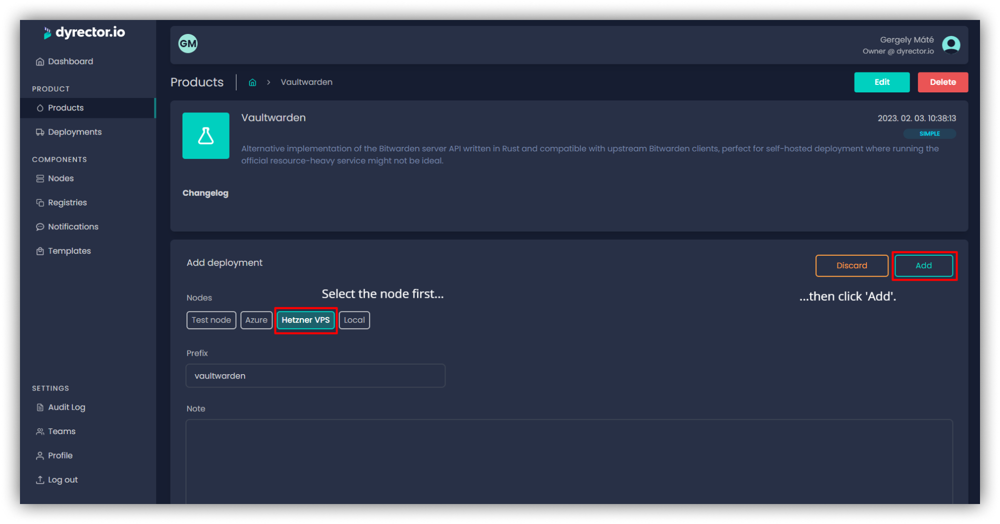
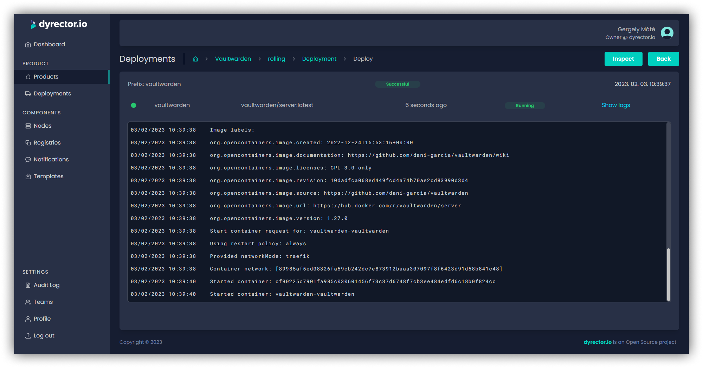
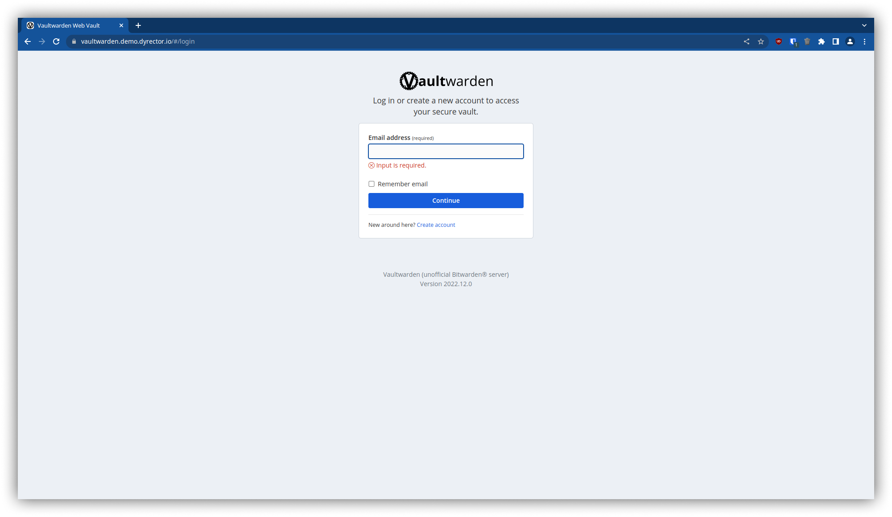

**Vaultwarden is a self-hosted implementation of Bitwarden. Its broad use case leaves room for individual and professional password management. Here’s how you can set up Vaultwarden from setting up a VPS to deploying it with the help of dyrectorio.**

---

## Step 1: Get yourself a VPS

Before you can do anything, you’ll need a VPS where you’ll host Vaultwarden.

<b>When looking for a VPS provider to host Vaultwarden, you need to consider several factors:</b>

- **Resources.** Vaultwarden isn’t a resource demanding application. According to a closed **[issue](https://github.com/dani-garcia/vaultwarden/issues/277)** from 2018 on the project’s GitHub repo, the stack can basically run on any hardware.

- **Location.** To reduce latency and get the most out of the VPS, choose a data center closest to your location.
- **Support.** Preferably the provider offers 24/7 customer support. It’s always useful if the provider has forums and other places where users can look for solutions in case they bump into difficulties.
- **Features.** Backups and security options might be useful when hosting Vaultwarden.

Some providers offer discounts based on how long you’re signing up for their offers. Some also offer free setup fee in case you sign up for a longer period of time.

For this case study, we used Hetzner.

Hetzner provides VPS with Ubuntu 22.04 and Docker CE’s latest version when this blog post is written. As already mentioned, Vaultwarden is a lightweight application so as long as you plan to run it as single service on the VPS, the lowest available hardware is fine. Scaling up the hardware is still a possibility at most providers in case you decide to host other services on the VPS, however, scaling down is usually not possible. Therefore, we chose VPS with the lowest specs Hetzner offers:

- **RAM:** 2 GB

- **VCPUs:** 1 (Intel)

- **SSD:** 20 GB

Now that the VPS is purchased, time to get a domain to easily access Vaultwarden.

### Free alternatives to Hetzner VPS

If you try to get the most out of Vaultwarden with minimal costs, you can set up free-tier AWS or Cloudflare accounts. You get minimal hardware which should be sufficient to run Docker and Vaultwarden.

## Step 2: Get yourself a domain

Having a domain isn’t necessary to host Vaultwarden, still, it makes sense to get one for better usability.

  
<b>Here’s what you need to keep in mind when picking the domain and its providers.</b>

- **Domain name.** Human readability is a basic need, especially if you want to host Vaultwarden to manage passwords of subscriptions that the whole family uses. IP addresses aren’t as user friendly as domains.

- **Extension.** Some extensions are pricier than others. For self-hosted Vaultwarden, it’s unnecessary to go fancy.

- **Support.** Again, 24/7 availability is preferable with additional resources users can check to solve problems.

- **Privacy.** Purchasers' personal data can be checked out on WHOIS. If you want to avoid this, you can redact it at the provider to protect personal data.

- **DNS.** This is required to point the domain to VPS.

We used GoDaddy to purchase a domain. Select the domain you prefer. With GoDaddy’s domain protection service, it shouldn’t cost more than $11-12 a month if you don’t need an email service.

After the purchase is complete, you're ready to connect the VPS to the domain.

## Step 3: Point the domain to your VPS

This process shouldn’t take more than a few minutes but keep in mind that some providers take 48 hours to process user requests to point a domain to a VPS. To do so, you need to add the VPS IP address to the domain’s DNS as an A record.

  
<b>In our case, the steps are the following:</b>

- Copy VPS IPv4 address from Hetzner account

- Head to GoDaddy, and delete all removable record from the domain’s DNS records

- Create a new A record, and paste the IPv4 address into it

There, our VPS is now ready to host Vaultwarden.

## Step 4: Add your VPS as a deployment target in dyrectorio

To be able to set up Vaultwarden on your VPS, you need to define it as a node on dyrectorio. You can access dyrectorio beta **[here](https://app.dyrectorio.com/auth/login)**. After signing up to the platform, it goes as the steps described below. More details about node setup are **[here](https://docs.dyrector.io/tutorials/register-your-node)**, but below you can see the steps of the process.

Check out the whole process in the video below:

<iframe width="560" height="315" src="https://www.youtube.com/embed/mAIf0nA_8Sw" title="YouTube video player" frameborder="0" allow="accelerometer; autoplay; clipboard-write; encrypted-media; gyroscope; picture-in-picture; web-share" allowfullscreen></iframe>

- Add a new node by selecting the `Node` panel on the left side and clicking on the `Add` button in the top right. Add a name and save the node.

- Select Docker Host as the technology of the agent that’ll be set up on your VPS. By clicking on the Generate script button, the platform will generate a one-liner you can use in the VPS’ terminal to install the agent. More details about Nodes and dyrectorio agents are documented **[here](https://docs.dyrector.io/tutorials/register-your-node)**. Use the toggle next to `Install traefik`, which will enable you to deploy to subdomains pointing to your VPS.

- Paste the one-liner in the terminal of the VPS on Hetzner, and press Enter. Soon dagent will run on the VPS and the node status will turn green from red.

The only remaining step is to deploy Vaultwarden to the VPS.

## Step 5: Deploy Vaultwarden to your VPS using dyrectorio

Click on `Templates` on the left and select Vaultwarden from the templates listed by clicking `Add`.

You're able to specify a name and a description to the Vaultwarden stack you plan to deploy. Depending on if you plan to roll out the latest version of Vaultwarden, you can pick if you want to deploy Vaultwarden as a simple or a complex type of product. More details on the differences **[here](https://docs.dyrector.io/tutorials/create-your-product)**, but a simple product will likely do for most users.

Click `Add` to save Vaultwarden as a product.

Click on the gear icon next to Vaultwarden's image. On the configuration screen specify the following variables with your domain:

- `name`, `host` under Ingress section. `name` is the first part of the domain, `host` is the second. Example: if your domain is `vault.example.com`, then `name = vault`, `host = example.com`.
- `DOMAIN` under Environments section. Example: if your domain is `vault.example.com`, then `DOMAIN` key will be `vault.example.com`.

When you got the domain configured, click `Back` to head back to Vaultwarden's overview.

Click `Add deployment`.

Select the Node – your VPS –, and click Add.

Click `Deploy` to setup Vaultwarden.

After the deployment status turns successful...

Traefik will take up to 5 minutes to do its magic. Enter domain in the URL bar and enjoy your self-hosted Vaultwarden, as seen below.

---

_This blogpost was written by the team of [dyrector.io](https://dyrectorio.com). dyrector.io is an open-source continuous delivery & deployment platform with version management._

**Find the project on [GitHub](https://github.com/dyrector-io/dyrectorio/).**

