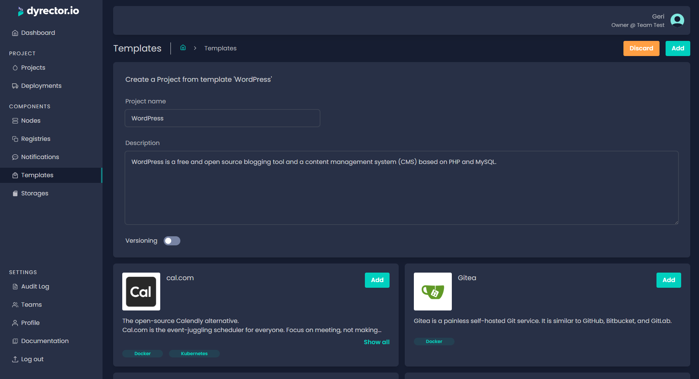
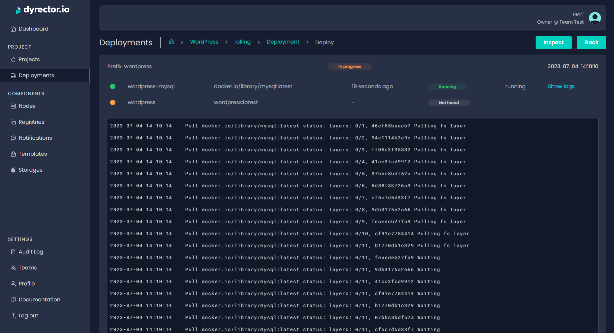

**WordPress is one of the most popular content management systems out there. The latest estimations show that more than 40% of all websites use WP in 2023. Due to its popularity, WordPress was one of the first templates that we added to dyrector.io. In this blog post, you can learn how you can set up the CMS on a free Oracle VPS with an ARM chip using dyrector.io.**

---

## Why ARM?

ARM64 architecture chips just dropped on the scene, most notably in Apple products. Prior to the appearance of Apple Silicon chips, ARM was available in smartphones and other mobile devices. But they’re present now in web servers and for other uses, as well. It’s because ARM chips need less resources to provide the computing power needed to handle incoming requests.

Lucky for you, Oracle offers a free VPS with an ARM chip. **Disclaimer:** dyrector.io isn’t related or associated with Oracle whatsoever. We take no responsibility in case Oracle terminates their free ARM VPS offer. The purpose of this blog post is strictly for educational purposes, not to promote any Oracle services or products.

## Why Is This Blog Post So Damn Long?

We dig straight to the point content. It only works when the reader has enough context to unpack everything. For people who have decades of experience with infrastructure or have been familiar with Docker, the whole process could be summed up in a paragraph. But this tutorial is mainly aimed at people who would like to create and maintain their own WordPress websites, and they might not have the experience with the technologies described. When I worked on this article, figuring out how to use certain technologies made me feel like this:


We’d like you to feel like The Hackerman, too, when you follow these steps.

## Have a VPS

First of all, you’ll need to get the VPS. You can do so by signing up to Oracle and completing the registration process.

Once you’re done signing up, you can set up your first VPS after navigating to the Instances page. The ARM option will be available in the _Image and shape_ section. When you pick the image, there’s a bunch of operating systems you can choose from, but we picked Ubuntu 22.04.

> **Note:** Personally, I decided to go with Ubuntu because it has a lot of resources online and I assumed my teammates are mostly experienced with that OS out of all the available ones on Oracle. Eventually it turned out to be a good idea.
You can pick any OS offered, the platform supports it, but some of the instructions below might not work, `apt install` for example.

The shape is where you can pick the free ARM chip, which is a 3.0 GHz **[Ampere Altra](https://www.oracle.com/cloud/compute/arm/)** with customizable OCPU and memory count. For the purpose of this blog post, I went with 1 OCPU and 6 GBs of RAM.

After selecting the OS and the CPU, save the private key generated by Oracle in the _Add SSH keys_ part. It’s important that you do it now, because it's the only time when you can. Otherwise, you won’t be able to access the VPS.

The VPS purchase process should turn quite straight forward after this, so all you have to do now is to follow the steps on Oracle until your instance starts.

## Access the VPS

Now that you have your VPS ready, you’re going to need Docker in order to be able to run containerized applications on it.

You can access the VPS via Oracle’s Cloud Shell, or when you use Windows on your PC or laptop, you can install **[PuTTY](https://www.chiark.greenend.org.uk/~sgtatham/putty/latest.html)**, which is a free and open-source SSH client. You’re going to use it to access the VPS using your private SSH key. To do that, first you’ll need to convert the .key file that you just downloaded to a .ppk that the client can work with.

> **Note:** You can access your VPN from the terminal when you use MacOS or other Linux distros on your local machine.

When PuTTY installation is complete, you’ll have PuTTYgen, too, which will be needed to convert the public key to a format the client can handle. You can do this by following the steps described **[here](https://docs.oracle.com/en/cloud/paas/goldengate-cloud/tutorial-change-private-key-format/)**.

Once the .ppk file is ready, open PuTTY, and paste the public IP address of your VPS to the _Host Name_ field as seen below.


Now, on the left side of the window, head to Connection / SSH / Auth / Credentials, and add the private key in .ppk format, as seen below.


You can save this configuration as a session for later use by heading back to Session.

When you’re ready, click _Open_. What you should see is the console of the VPS, which prompts you to enter the username in PuTTY. You can find the username that belongs to the Oracle instance right under the IP address but it’s `ubuntu` by default if that’s the OS you picked.

While you’re there, run `sudo -s` to get root access to your VPS. The following command will save you a lot of time wondering why you can’t access your website even when you’ve done everything right. Without getting into details, run the following command:

```
iptables -I INPUT 6 -m state --state NEW -p tcp --dport 80 -j ACCEPT
iptables -I INPUT 6 -m state --state NEW -p tcp --dport 443 -j ACCEPT
netfilter-persistent save
```

> **Note:** The commands above will add new port rules to the VPS on the level of Ubuntu. It’s going to enable incoming requests. Treat this command like black magic: it’s something you should never do, only as a last resort option because it might expose your VPS to people with malicious intent unnecessarily.

## Install Docker

Now you’ll install Docker on the VPS by following the steps below:

1. Enter `sudo apt-get update`, to update apt package index.

2. Install Docker Engine with the command:
- `sudo apt-get install docker-ce docker-ce-cli containerd.io docker-buildx-plugin docker-compose-plugin`. 

Sometimes the process comes back with a `Package 'docker-ce' has no installation candidate` error message. When that happens, enter the command below:

```
sudo apt install apt-transport-https ca-certificates curl
software-properties-common 
curl -fsSL https://download.docker.com/linux/ubuntu/gpg | sudo apt-key add - 
sudo add-apt-repository "deb [arch=amd64] https://download.docker.com/linux/ubuntu `lsb_release -cs` test" 
sudo apt update 
sudo apt install docker-ce
```

This worked every time as a last resort command when we tested Oracle’s VPS, so if it doesn’t work either, check the error message that comes back.

3. When the process is complete without any errors, enter `docker -v` just to make sure that Docker Engine is indeed installed on the VPS. This will respond with the Docker Engine’s version running.

## Get a Cheap Domain

Or buy an expensive one, all the power to you. The purpose of getting a domain is to provide easy access for the outside world to your website. There are many alternatives where you can get one, but our primary choice is Namecheap.

Namecheap offers .com domains starting from around $10 but you might be able to catch some type of promo that’ll make the price tag even better. After you pick the domain you’d like to use, Namecheap will offer you SSL you won’t need when you use dyrector.io. The only thing we recommend selecting is Domain Privacy, which will hide your personal data from WhoIs database.

## Connect the VPS and the Domain

Once the purchase is done, you can connect your server to your domain on Namecheap. To do this, click the _Manage_ button next to the domain on the dashboard, and navigate to the _Advanced DNS_ tab.

1. Click _Add new record_ and select A record.

2. Host should be `*`, and Value should be the public IP of your VPS. Set TTL to 30 mins and click on the green checkmark next to it.

3. Add another A record with the same settings but Host is `@` this time.

When you’re done with these steps, all you have to do is wait until the process is complete. In the meantime, you can sign up to dyrector.io.

## Add Your VPS to dyrector.io

Head to **[app.dyrectorio.com](https://app.dyrectorio.com)** and go to the sign-up page. After the email verification and team creation, add your VPS as a node on the platform by following the steps below:

1. Go to Nodes and add a new one. Enter a name and click the _Save_ button.

2. On the script generation card make sure the settings are like this:

- Docker Host is selected,

- Install Traefik is enabled,

- ACME email address is added, it can be the email address you use,

- Shell is selected.

3. Click `Generate script`,

4. Open PuTTY console and run `sudo -s` if you don’t have root access to the VPS.

5. Copy the generated script from the platform and run it in the console. In a few moments node status should turn active indicated by a green light.

## Set Up WordPress on Your VPS

Click on Templates on the left on dyrector.io and select WordPress by clicking Add.


You're able to specify a name and a description to the WordPress stack you'd like to deploy as a project. Save the project without versioning.



Click _Add deployment_, then select the VPS listed as a Node, and click _Add_.


Click on the gear icon next to WordPress's images to navigate to the configuration screen and specify the following variables:

**wordpress-mysql:**

- `MYSQL_PASSWORD`, which should be a secure password, it can be readable or a generated one.

**wordpress:**

- `WORDPRESS_DB_PASSWORD` should be the same as `MYSQL_PASSWORD` for wordpress-mysql.

- Configure `name`, `host` under Ingress section. `name` is the first part of the domain; `host` is the second. Example: if your domain is `wordpress.example.com`, then `name = wordpress`, `host = example.com`.

- Configure `DOMAIN` under Environments section. Example: if your domain is `wordpress.example.com`, then `domain = https://vault.example.com`.

- Expose Strategy should be HTTPS.

- In the `Ports` section make sure that Internal is 80 and External has no value.

When you’ve got it configured, click _Back_ to head back to your WordPress stack’s overview.


Click _Deploy_ to setup WordPress.



After the deployment status turns successful, enter domain in the URL bar and enjoy your self-hosted WordPress. You can check out how it worked out for me **[here](https://wordpress.gerimate.com)**.

---

_This blogpost was written by the team of [dyrector.io](https://dyrectorio.com). dyrector.io is an open-source container management platform._

**Find the project on [GitHub](https://github.com/dyrector-io/dyrectorio/).**
