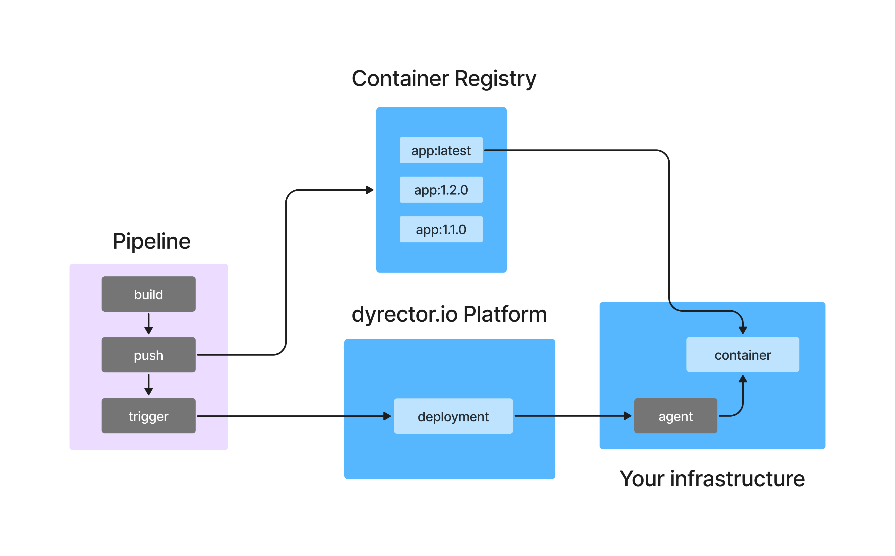

**GitHub Actions is one of the most popular ways to cut waste from your processes when you maintain software. It’ll take care of mundane, repetitive tasks of integration and delivery while you take care of some other business. Here’s how you can extend your GitHub Actions pipeline with automated deployments to any environment you use.**

---

## How GitHub Actions Works?

GitHub Actions is a platform that automates developer workflows. It’s popular as it’s modular, community focused, and reusable, however some might not be a fan of it being too verbose, atomic, and untestable locally. One of the most common use cases of GitHub Actions is to create CI/CD pipelines, as it’s able to automate all the tasks of building a container or pushing an image to a registry.

Some CI/CD pipelines stop there but others prefer to deploy the new image for their users right away in a continuous manner. GitHub has preset deployment workflows available in the Actions marketplace, but those are cloud provider specific ones.

## Create Your Continuous Deployment Workflow

For the purpose of this blog post, we’re going to use [dyrector.io](https://github.com/dyrector-io/dyrectorio), which is an open-source continuous delivery platform that you can use to deploy applications to all cloud providers and on-premises infrastructures.

### Generate Your Continuous Deployment Token

#### Step 1: Install agent

After creating an account on dyrector.io, install the platform's agent where you’d like to continuously deploy your application. You can do so by generating a Shell or a PowerShell install script depending on your OS. The script will take care of making a connection between the platform and your infrastructure. The agent – written in Go – will run as a Docker container. You can set up the agent by following **[these steps](https://docs.dyrector.io/tutorials/register-your-node)**.

#### Step 2: Add your registry

When your infrastructure is ready for deployments, which is signaled by node status turning green, navigate to registries and add your registry. Any V2 compatible registry can be added, even locally stored images as an unchecked registry. Check the **[docs](https://docs.dyrector.io/tutorials/add-your-registry)** for more info.

#### Step 3: Create a project out of your images

The next step will be to create the deployable stack, a project on the platform. You can do so by navigating to the project page. The new project needs to be a versioned one. When it’s done, add a new rolling version to the project, and click the Add images button to browse added registries for your images. The whole process is documented **[here](https://docs.dyrector.io/tutorials/create-your-product)**.

#### Step 4: Create the CD token

When you have all the images added, move forward by adding a deployment, where you can create a continuous deployment token. 

Token creation goes as below: 
- Click on the Create token button.
- Enter a name for your token and click the Create button.
- The platform will generate the token and the curl command. Make sure you copy and paste it somewhere secure because you won’t be able to retrieve it otherwise.

### Add the curl Command to GitHub Actions

The last step will be pretty simple. Take the curl and create a job for it in GitHub Actions. The result should look like the example below:

```
name: "github actions example" 

on: 
  push: 
    tags: 
      - 'latest' 
  
jobs: 
  run-updater: 
    runs-on: ubuntu-latest 
    steps: 
    - name: continuous deployment 
      run: | 
        curl -X POST -H 'Authorization: Bearer ${YOUR_JWT_TOKEN}' https://app.dyrectorio.com/api/deployments/${YOUR_DEPLOYMENT_ID}/start
```

The `tags` in the example refers to when the pipeline pushes an image with the latest tag to the container registry. This event will run the curl command, which we named continuous deployment.

`YOUR_JWT_TOKEN` refers to the token generated on the platform, and it should be used as a secret in your pipeline to keep it secure. `YOUR_DEPLOYMENT_ID` is the deployment ID in the platform, and you can use it as is because it can't be utilized without the JWT token.

## How Does Continuous Deployment Work?

As you can see in the flowchart below, dyrector.io’s continuous deployment functionality fits into a schematic CI/CD workflow on GitHub Actions. The pipeline triggers continuous deployment on the platform when the image is pushed to the registry.

The purple area in the flowchart represents a GitHub Actions pipeline which builds the container and pushes the image to a repository. Then it triggers the platform to execute the deployment by signaling the node to pull and start the container with the tag which already exists on the node.



## Why Is It Worth It?

> Short answer: you’ll save a lot of time.

As already mentioned, it’s a lot more flexible solution compared to GitHub Actions marketplace alternatives as it’s a technology and cloud provider agnostic way for deployments.

One of the key factors why it’ll save you time is that you won’t need to work with SSH keys. Other solutions, like GitLab, will be a slower process because you’re going to need SSH keys as shown in this tutorial.

When you work with multiple environments, as in you’d like to deploy the application to different servers, you won’t need multiple GitHub Actions pipelines. Instead, one will trigger the deployment to all the environments you want to deploy your software.

In case you need to adjust some configuration variables, like exposing a port or adding a new environment variable, you can do so without touching any of the JSON or YAML files and make the changes via the platform.

---

_This blogpost was written by the team of [dyrector.io](https://dyrectorio.com). dyrector.io is an open-source continuous delivery & deployment platform with version management._

**Find the project on [GitHub](https://github.com/dyrector-io/dyrectorio/).**
