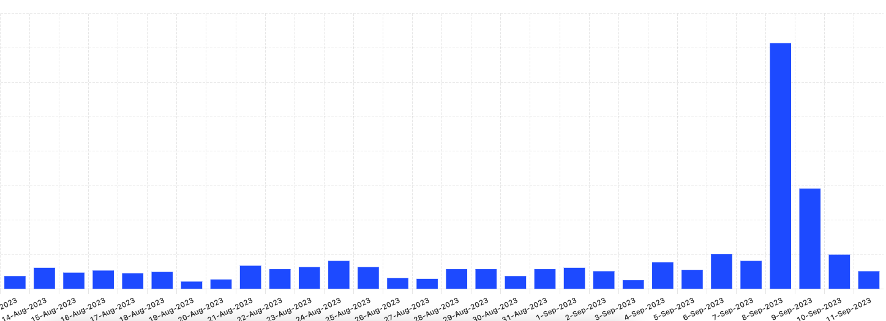
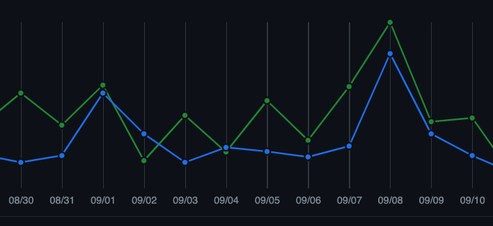

**We launched again on Product Hunt. While we did fine, we had to come to the realization that we’re not fit for Product Hunt but it’s totally fine. But if you feel like you shouldn’t launch on Product Hunt, what are your options?**

---

We launched for the 2nd time on Product Hunt this month. The results were fine: with a relatively niche product we finished 6th with around 260 upvotes. Amongst the open-source projects that week, our launch was one of the most successful.

As a result, we gained a few sign-ups, the traffic on our website was one of the highest of all time, some users gave our GitHub repository a look and starred it, too. As you can see below, our website traffic spiked for a 10x number compared to the day before, and GitHub traffic went 5x.

It’s worth noting that because of Product Hunt’s mechanics, we accidentally had our product’s log in site as the Visit link for 6 hours into launch day, so we missed out on some traffic. My hypothesis is that we experienced this increase because it was probably our most active day on social media, but we definitely weren’t posting this much since the Web Summit in 2021 (which we’ll attend again this year).

Anyway, we consider the launch a success as it made some publicity for our platform, however, we could’ve done better. But the bittersweet reality is that we didn’t really have a chance.

## Product Hunt Became a Cheap Thrill

Back in February, when I connected folks for our first launch on LinkedIn, I thought these connections would stay somewhat relevant in the future. Obviously, this couldn’t be any further from the truth.

Similar to the majority of products that are on Product Hunt, the connections that come from the platform are so superficial that after 5 minutes it won’t matter at all. On the flipside of this, there are a couple of people who I’ve met because of Product Hunt, and they seem genuine.

The result of these superficial connections was that the majority of folks who supported us in February didn’t bother responding, let alone upvoting us. I didn’t count but I’d estimate that their support could’ve landed us in the top 4 on Friday.

## Product Hunt Lost Its Charm

The prestige of Product Hunt is quickly fading. Once upon a time Product Hunt was the place where you could meet innovators trying to make their mark on how you’re getting things done and deliver value.

The “community” Product Hunt has to offer picks up and puts down products like a kid does with toys in recess. I saw a crypto project that earned a Web3 project of the year badge in 2021, launched again this year for a daily #6 and weekly #82 spot. The new cool kid is generative AI and Notion until the next cool kid shows up, even though, it’s hard to see the value most of these projects offer.

Now you can barely find anything on the platform that’s not a GPT wrapper or a Notion related project that even the maker doesn’t care about after launch day. I’ve seen makers who essentially don’t work on anything else than GPT wrappers, launch every other week and move on to the next wrapper. Not surprisingly, these makers post discussions that are filled with so many buzzwords and copywriting trigger words that you might need ChatGPT to decipher to a human language.

Your best bet on Product Hunt is with a product aimed at a general audience or a few niches that tend to utilize automation before anyone else – such as sales. You’ll have to spend a few weeks before launch connecting with as many people as you can because your competition will be hungry in this area. Ideally these people fit into your ICP. Plus, your messaging needs to be on point.

## Where Else Can You Showcase Your Product?

For general B2C tools, I’m not sure. Maybe **[Show HN](https://news.ycombinator.com/show)** is a good place, but your stuff needs to slap to gain any attention from the Hacker News community and you pretty much have to nail everything. Most importantly: when you make it on Show HN, you know you’re on to something with your stuff.

For developer tools, such as dyrector.io, **[DevHunt](https://devhunt.org/)** seems like a promising platform. It’s still early on the journey to make a global impact. But they recently launched on Product Hunt and finished #1 on the daily vote, meaning there's demand for actual products. By the way, we were developer tool of the week on DevHunt last month, and if you’re curious about up-and-coming developer tools, you should check them out. In the meantime, I launched the weekly series of DevHunt Digest where I share my thoughts about the products launching on the platform. Check it out on **[Dev.to](https://dev.to/gerimate/devhunt-digest-1-whos-going-to-win-this-week-2oh0)** for the 1st part of the series.

## Support Us With a Star on Github

Launch day is over for a couple days now. We appreciate the support of everyone who showed up. If you haven’t, you can still support us by giving a star on GitHub at the link below:

- **https://github.com/dyrector-io/dyrectorio**

---

_This blogpost was written by the team of [dyrector.io](https://dyrectorio.com). dyrector.io is an open-source continuous delivery & deployment platform with version management._

**Support us with a star on [GitHub](https://github.com/dyrector-io/dyrectorio/).**
